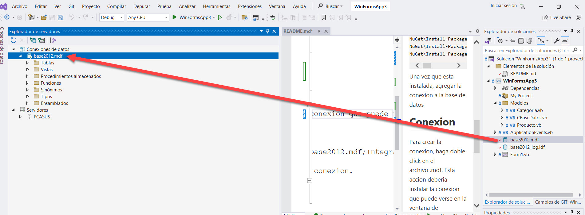
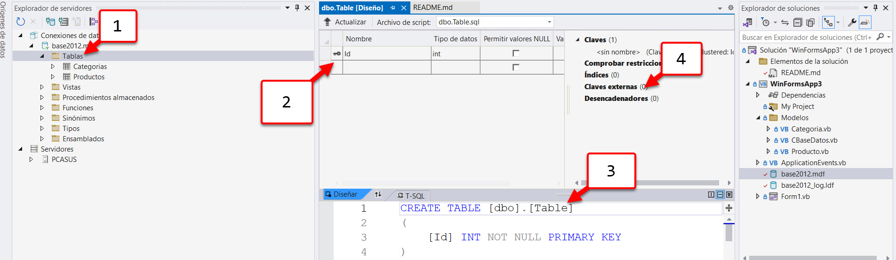

# vb20231004_1
* Crear un proyecto nuevo.
* Tome los archivos de la base de datos, y arrastrelos y sueltelos en el explorador de solución


## Para instalar las herramientas para conectarme a la base de datos

Ejecutar esto en la consola de administracion de paquetes (Herramientas -> admin paquetes nuget -> consola)


```shell
NuGet\Install-Package EntityFrameworkCore.VisualBasic -Version 7.0.0
NuGet\Install-Package Microsoft.EntityFrameworkCore.SqlServer -Version 7.0.11
NuGet\Install-Package Microsoft.EntityFrameworkCore.Tools -Version 7.0.11
```


Una vez que esta instalada, agregar la conexion a la base de datos

## Conexion
Para crear la conexion, haga doble click en el archivo .mdf.  Esta accion deberia instalar la conexion que puede verse en la ventana de Explorador de Servidores.



## Creacion de tablas



1) Con el boton derecho en las tablas, creo una nueva tabla
2) Selecciono las columnas que quiera para esa tabla.
3) Cambio "Table" por el nombre de la nueva tabla.
4) (opcional), si necesito una clave externa, la agrego ahi.
5) Y por ultimo, presiono en el boton actualizar (arriba del punto 2)

## crear los datos

Una vez que la conexion esta lista, seleccione la conexion y vea las propiedades

Luego, copie la cadena de conexion.
> Ejemplo: "Data Source=(LocalDB)\MSSQLLocalDB;AttachDbFilename=C:\cursovb2023\WinFormsApp3\WinFormsApp3\base2012.mdf;Integrated Security=True"


En la consola de administracion de paquetes: (cambie lo que esta en asterisco por su cadena de conexion.
```shell
Scaffold-DbContext "****" Microsoft.EntityFrameworkCore.SqlServer -OutputDir Models -Force
```

> Ejemplo: Scaffold-DbContext "Data Source=(LocalDB)\MSSQLLocalDB;AttachDbFilename=C:\cursovb2023\WinFormsApp3\WinFormsApp3\base2012.mdf;Integrated Security=True" Microsoft.EntityFrameworkCore.SqlServer -OutputDir Models -Force

Opcionalmente, en el explorador de solución, cambiar en la carpeta models, el archivo con nombre largo

